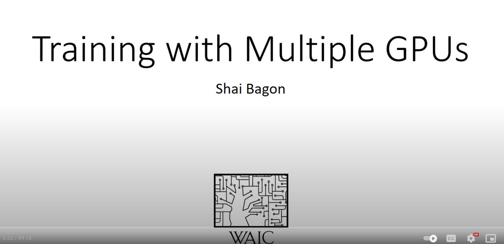
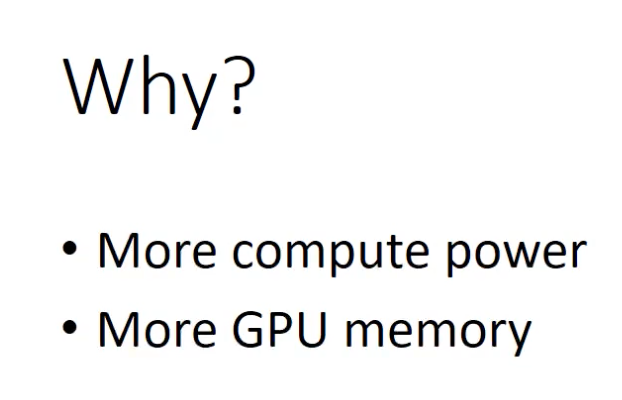
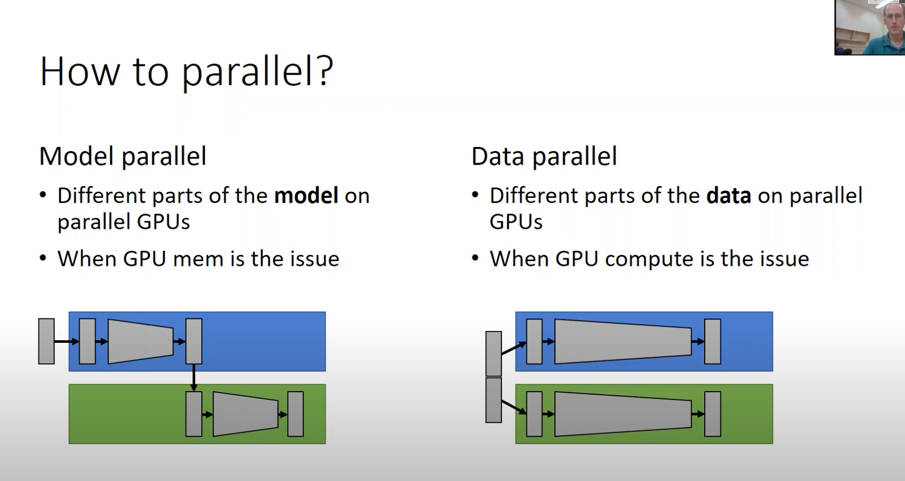
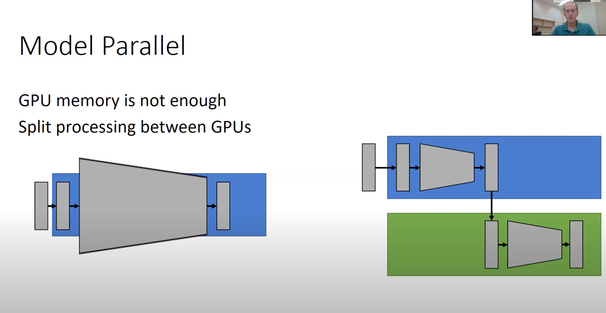
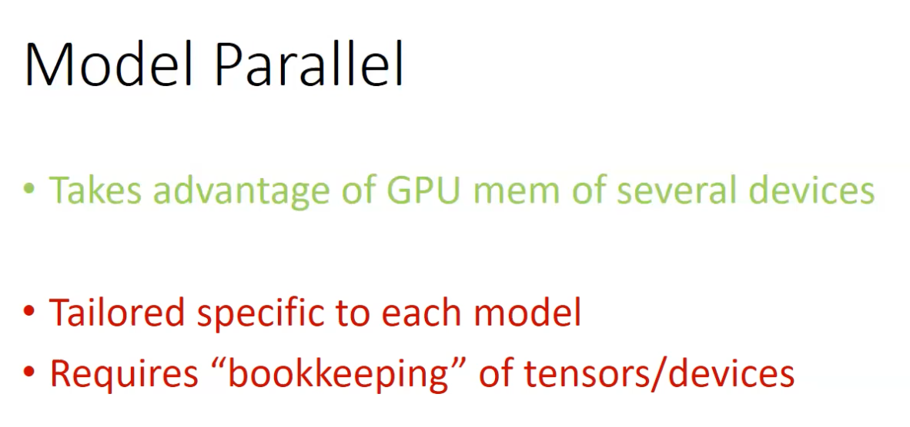
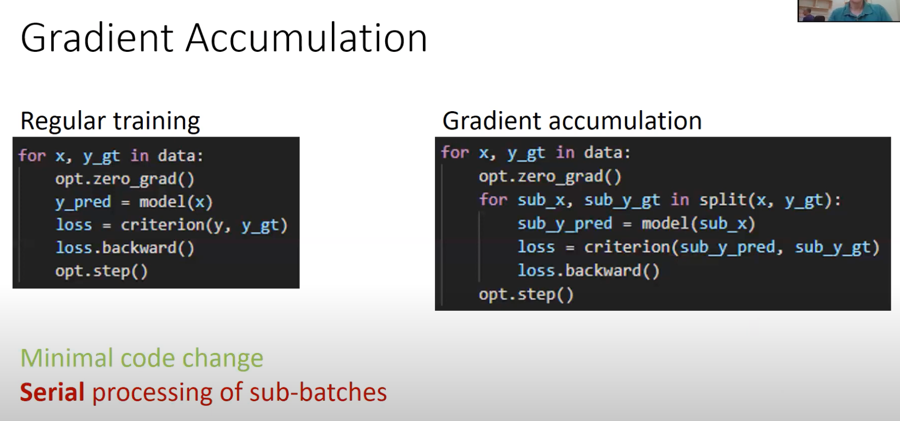
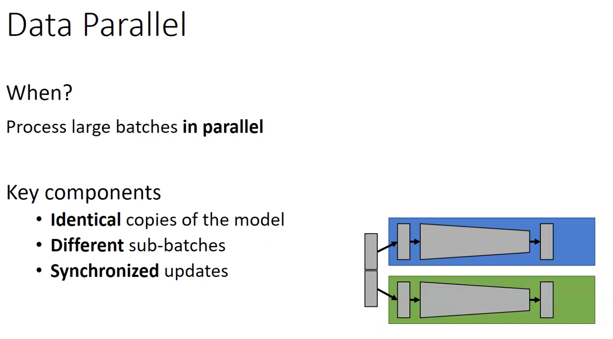
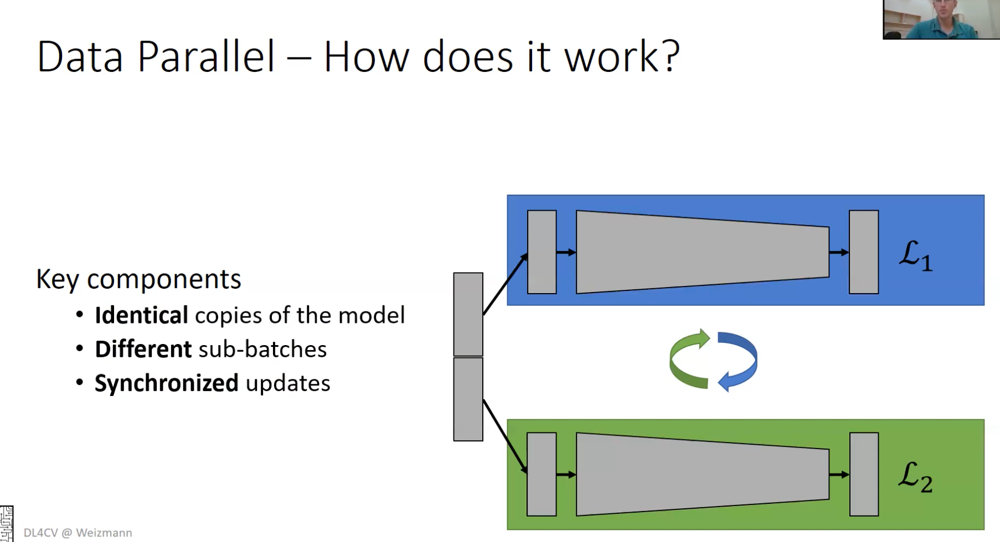
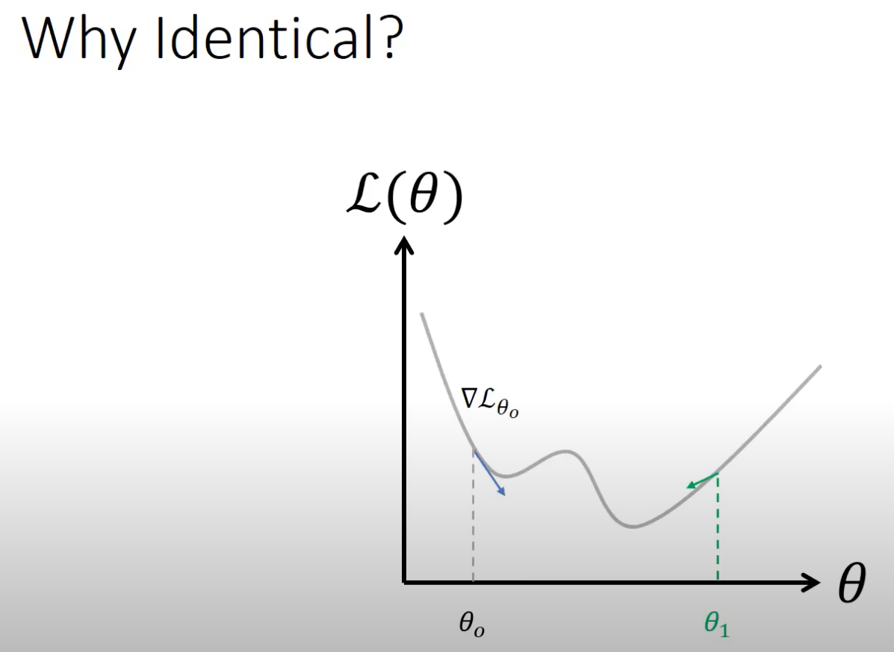
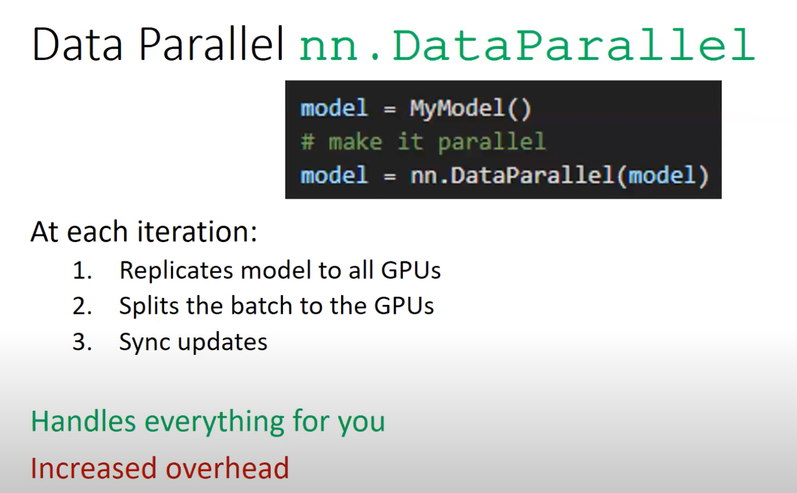

Notes from a great tutorial: https://www.youtube.com/watch?v=TibQO_xv1zc










```python
class ModelParallel(nn.Module):
    def __init__(self, ...):
        super(ModelParallel, self).__init__()
        self.part_1 = nn.Sequential(
            ...
        )
        self.part_2 = nn.Sequential(
            ...
        )
        # Put each part on a different device
        self.part_1.to(torch.device('cuda:0'))
        self.part_2.to(torch.device('cuda:1'))

    def forward(self, x):
        x = x.to(torch.device('cuda:0'))
        x1 = self.part_1(x)
        # Move to second device
        x1 = x1.to(torch.device('cuda:1'))
        y = self.part_2(x1)
        return y
```





## Gradient Accumulation

```python
# Regular Training
for x, y_gt in data:
    opt.zero_grad()
    y_pred = model(x)
    loss = criterion(y, y_gt)
    loss.backward()
    opt.step()
```

```python
# Gradient Accumulation
for x, y_gt in data:
    opt.zero_grad()
    for sub_x, sub_y_gt, in split(x, y_gt):
        sub_y_pred = model(sub_x)
        loss = criterion(sub_y_pred, sub_y_gt)
        loss.backward()
    opt.step()
```





# Data Parallel

## Bottleneck is GPU compute









```python
model = MyModel()
model = nn.DataParallel(model) # make it parallel
```


```python
def train(rank, args):
    # init the process in context
    torch.distributed.init_process_group(backend='nccl', 
                                         init_method='tcp://127.0.0.1:54263', 
                                         world_size, rank)
    ...
    # wrap the model
    model = nn.parallel.DistributedDataParallel(mode, device_ids=[rank])

    # use "distributed aware" sampler
    sampler = torch.utils.data.distributed.DistributedSampler(
                train_dataset,
                num_replicas=world_size,
                rank=rank
    )

    loader = DataLoader(train_dataset, batch_size,
                        shuffle=False, sampler=train_sampler)
```


------------------


